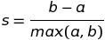

# Data Mining II
## Project Proposal
Sankirna Joshi  
April 20th, 2020

## Proposal
A study of Unsupervised Learning techniques on the FIFA 20 dataset.

## Domain Background
Unsupervised learning is one of the three main domains of machine learning, along with supervised learning and reinforcement learning. In unsupervised learning, the objective is to look for previously undetected patterns in a dataset without any pre-existing labels and with a minimum of human supervision. In contrast to supervised learning that usually makes use of human-labelled data, unsupervised learning allows for the modeling of probability densities over inputs.    
The FIFA 20 is a dataset consisting of the entire roster of players available on the EA sports' FIFA 20 video game. It includes various physical attributes of the players, their market value, teams and nationalities; and is an ideal candidate for studying unsupervised learning techniques due to the richness of the data such as the vast variety of different clusters that can be formed among the players and the available labels that can withheld to compare the performance.

## Problem Statement
Our goal is to study and apply unsupervised learning to the FIFA dataset to mine for interesting patterns. While, the labels are not usually available for unsupervised learning approaches, domain knowledge can prove to be useful for inferring the patterns that we uncover. In this project, we will explore the clusters the players form based on their attributes to see if we have discovered any patterns inherent in the data, compare it with withheld labels and evaluate the clustering performance wherever feasible.

## Datasets and Inputs
The [dataset](https://www.kaggle.com/stefanoleone992/fifa-20-complete-player-dataset) for this problem is hosted on Kaggle. The dataset includes the complete player data from the career mode of FIFA 20. The data contains 100+ attributes including player demographics, positions they play at the club and country level, physical attributes, wages, attacking and defending skills etc. In total, there are over 18000 players and about 100 columns per player. Thus, this data is high dimensional and we can apply PCA to reduce the dimensionality. The player positions, nationalities, skills etc could help us check if there are any distinct clusters in the data.

## Solution Statement
Since unsupervised learning is an end-goal in itself, this project will focus on trying to ask interesting questions about the data and finding any patterns that could help answer those questions. 

## Evaluation Metrics
In unsupervised learning, 0evaluating the performance of the model is generally unanswerable as there is no known _truth_ labels to compare and evaluate our model against. However, depending on the problem at hand, we might already know the number of clusters available in the data. When this is not known, we may not know what structure exists within the data — if any. However, we can quantify the “goodness” of a clustering by calculating each data point’s [silhouette coefficient](http://scikit-learn.org/stable/modules/generated/sklearn.metrics.silhouette_score.html). A higher Silhouette Coefficient score relates to a model with better defined clusters. The score is bounded between -1 for incorrect clustering and +1 for highly dense clustering. Scores around zero indicate overlapping clusters. Thus, when scores are higher, we can ascertain a good cluster as a higher score means dense and well separated clusters, which relate to the standard definition of cluster.    
The Silhouette Coefficient is defined for each sample and is composed of two scores:    
a: The mean distance between a sample and all other points in the same class.    
b: The mean distance between a sample and all other points in the next nearest cluster.

The Silhouette Coefficient s for a single sample is then given as:    

The Silhouette Coefficient for a set of samples is given as the mean of the Silhouette Coefficient for each sample.

## Project Design
- Programming Requirements
    - Python 3.6.6
    - sklearn 0.22.2
    - pandas 0.25.3
    - numpy 1.18.2
    - matplotlib 3.2.1
    - seaborn 0.10.0

- Data
    - FIFA 20 dataset on Kaggle.

- Project Steps
    - Data Exploration
    - Feature Relevance
    - Feature Scaling
    - Outlier Detection
    - Feature Transformation with PCA
    - Clustering
        - Gaussian Mixture Models
        - KMeans Clustering
    - Cluster Visualization with Biplots
    - Data Recovery
    - Conclusions and findings
